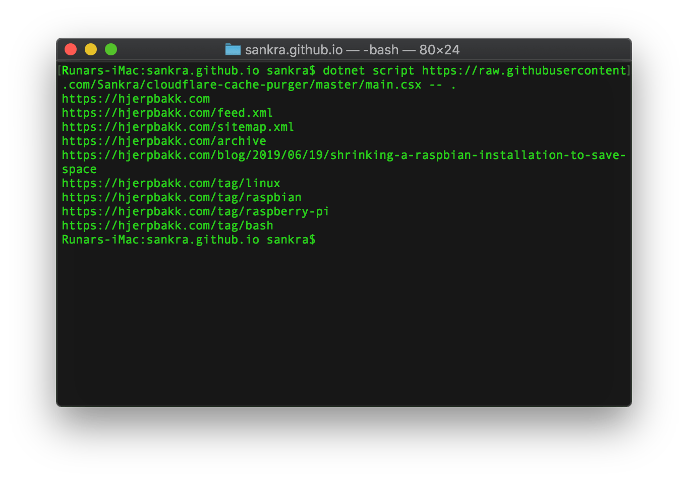

# cloudflare-cache-purger

## What it does

This script clears the cache on Cloudflare when adding a new post to a Jekyll repository. In addition to the tag pages matching the tags of the latest post and the post itself, it clears the following hardcoded pages:

- .
- . /feed.xml
- . /sitemap.xml
- ./archive

## Running

The script takes one argument. This is the `path to the Jekyll repo`.

### Locally

```bash
$ dotnet script main.csx -- path_to_jekyll_repo
```

### Directly from GitHub

```bash
$ dotnet script https://raw.githubusercontent.com/Sankra/cloudflare-cache-purger/master/main.csx -- path_to_jekyll_repo
```

Caution, do not run scripts from the Internet that you do not fully understand.

## Dry run

If the script cannot find `config.json`, the generated paths will only be written to standard out. The default site is `https://hjerpbakk.com`, but this can easily be changed to your domain within the script.

<p align="center">
    
</p>

## Clear Cloudflare cache

To use this with Cloudflare, clone the repo, create `config.json` from `config.default.json` and input your configuration values.

Running the script now will call the Cloudflare API and do the needful.