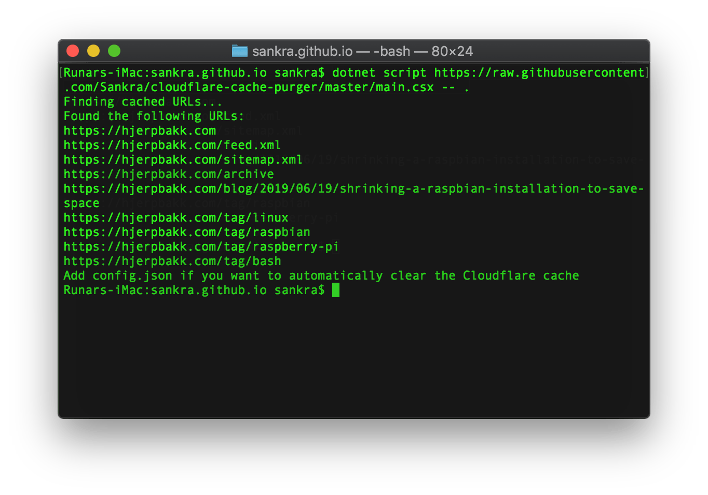
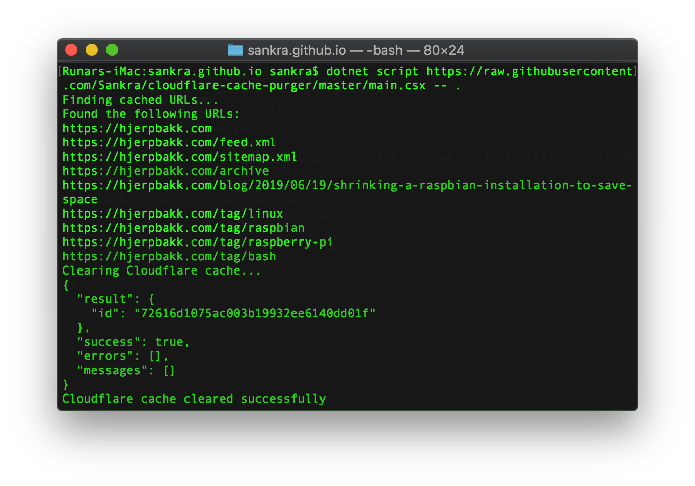

# cloudflare-cache-purger

## What it does

This script purges relevant pages from the cache on Cloudflare when adding a new post to a Jekyll repository. In addition to the tag pages matching the tags of the latest post and the post itself, it purges the following hardcoded pages:

- .
- . /feed.xml
- . /sitemap.xml
- ./archive

## Running locally

```bash
$ dotnet script main.csx -- path_to_jekyll_repo
```

## Running from GitHub

```bash
$ dotnet script https://raw.githubusercontent.com/Sankra/cloudflare-cache-purger/master/main.csx -- path_to_jekyll_repo
```

Caution, do not run scripts from the Internet that you do not fully understand.

## Configuration

The script takes one argument. This is the `path to the Jekyll repo`.

If a `config.json` file is added to the same directory, the script will try to actually purge the cache. If this file is missing, the script only prints what it would’ve done.

`config.json` should look like this:

```JSON
{
   "baseAddress": "[baseAdress]",
   "cloudflareApiKey": "[cloudflareApiKey]",
   "cloudflareEmail": "[cloudflareEmail]",
   "cloudflareZoneId": "[cloudflareZoneId]"
}
```

- `baseAdress` is the URL to your site.
- `cloudflareApiKey` is your Cloudflare API key. You can see this on your *profile*.
- `cloudflareEmail` is the email to your user on Cloudflare.
- `cloudflareZoneId` is the id of this site on Cloudflare. You can see this in the *overview* tab for your site.

## Dry run

If the script cannot find `config.json`, the generated paths will only be written to standard out. The default site is `https://hjerpbakk.com`, but this can easily be changed to your domain within the script.

<p align="center">
    
</p>

A dry run can also be forced by using a second argument:

```bash
$ dotnet script main.csx -- path_to_jekyll_repo dry_run
```

## Clear Cloudflare cache

To use this with Cloudflare, clone the repo, create `config.json` from `config.default.json` and input your configuration values.

Running the script now will call the Cloudflare API and do the needful.

<p align="center">
    
</p>